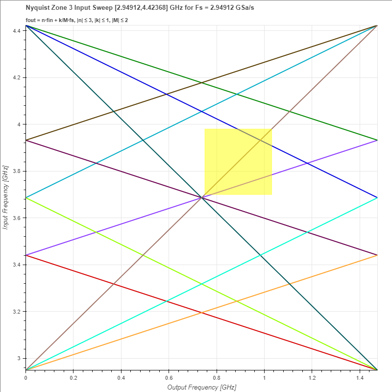

# Converter Examples

An example is taken from the following reference:

> Chuang, Kevin, et al. "[Radio Challenges, Architectures, and Design Considerations for Wireless Infrastructure: Creating the Core Technologies That Connect People Around the World.](https://ieeexplore.ieee.org/abstract/document/9933984)" *IEEE Microwave Magazine* 23.12 (2022): 42-59.

In which the "C-band" (3700 to 3980 MHz) is sampled at a rate of 2949.12 MHz in the 3rd Nyquist zone.

```python
from spurchart.converter import Conversion

myconverter = Conversion(fs=2.94912, input_zone=3, output_zone=1, maxorder=(3, 1, 2))
myconverter.addband(3.7, 3.98)
myconverter.plot()
```
This will generate an interactive plot using Bokeh (static bitmap is shown below):


