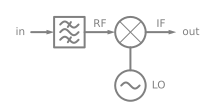
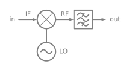
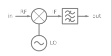

# Mixer Spurcharts

Assuming that the mixer ports are defined such that $f_{RF} > f_{IF}$, the intermodulation products of a mixer are the solution to the following equations:

${n}f_{LO} + {m}f_{IF} = f_{RF}$, for upconversion

${n}f_{LO} + {m}f_{RF} = f_{IF}$, for downconversion

where $m$ and $n$ are integers.

The above equations can be re-written such that the term on the left-side of the equation is the output of a transmitter or the input of a receiver:

|                 | Upconversion                                                                          | Downconversion                                                                          |
| --------------- |:-------------------------------------------------------------------------------------:|:---------------------------------------------------------------------------------------:|
| **Transmitter** | $f_{RF} = {n}f_{LO} + {m}f_{IF}$                  | $f_{IF} = {n}f_{LO} + {m}f_{RF}$                  |
| **Receiver**    | $f_{IF} = \frac{1}{m}f_{RF} - \frac{n}{m}f_{LO}$  | $f_{RF} = \frac{1}{m}f_{IF} - \frac{n}{m}f_{LO}$  |

The `spurchart` module can create spur charts for all integers $n$ and $m$.  The generated spur charts will show the mixer intermodulation products using the relative levels for a typical double-balanced mixer as calculated by [Bert Henderson](https://www.rfcafe.com/references/articles/wj-tech-notes/predicting-intermod-suppression-double-balanced-mixers-v10-4.pdf).

For a transmitter, the plot represents the power of the intermodulation products eminating from the output port of the mixer. For a receiver, the plot represents the mixer's susceptibility to the intermodulation products at its input port.

### Swept Spurchart using `spurchart.mixer.swept`

A spur chart can be plotted as versus a tuned LO frequency using `spurchart.mixer.swept.Transmit()` and `spurchart.mixer.swept.Receive()`. The x-axis will be inferred from the arguments to `Transmit()` and `Receive()`.

### Spectrum Spurchart using `spurchart.mixer.Spectrum()`

Sometimes it is useful to view the "spectrum" of a mixer's intermodulation products at a specific LO frequency. This can be done using `spurchart.Spectrum()`. Like `Swept()`, the x-axis will be the RF input or RF output of a receiver or transmitter, respectively.
