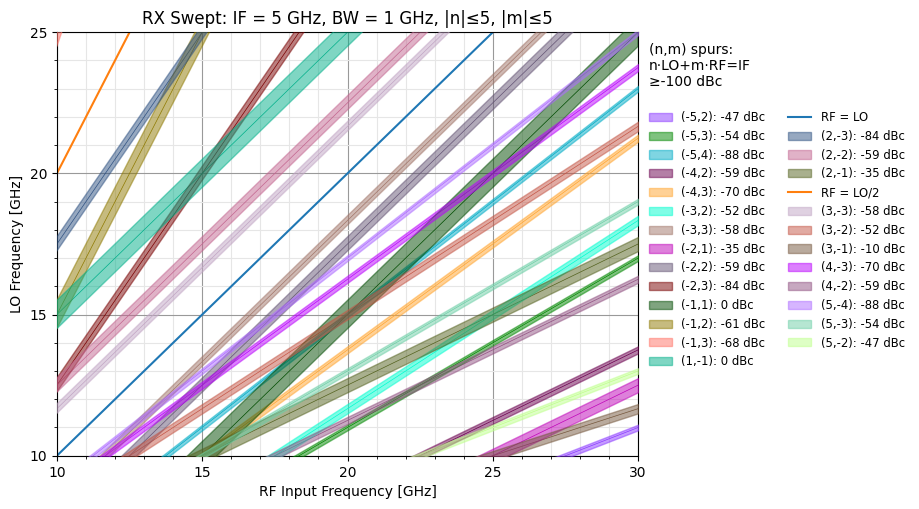
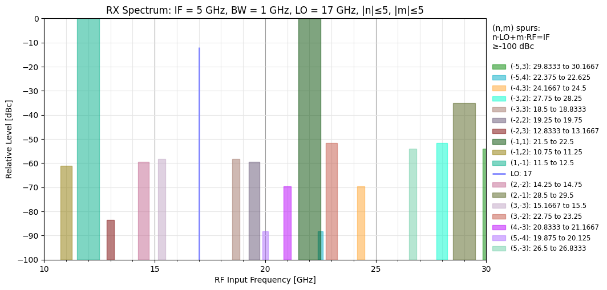
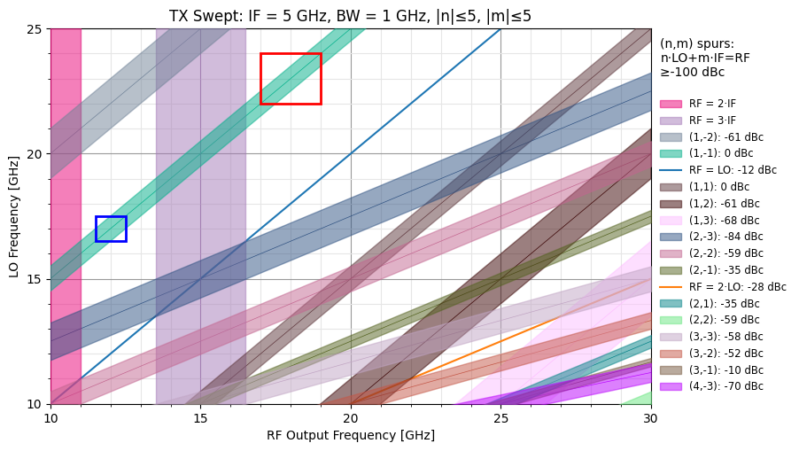
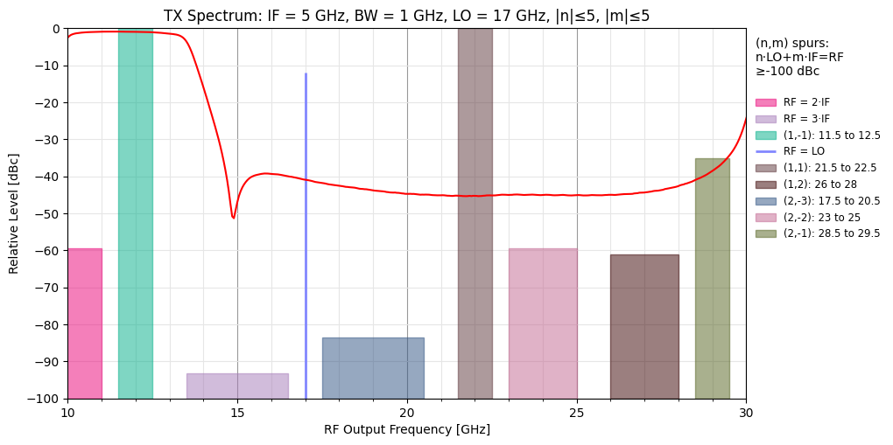

# Mixer Examples

Create a *swept* spurchart for a receiver over the RF frequency range of 15 to 30 GHz, with an IF of
5 GHz and a bandwidth of 1 GHz:

```python
from spurchart.mixer import Swept, Spectrum

bw = 1
fif = 5

Swept(frf=(10, 30), fif=fif, flo=(10, 25), bw=bw, conversion="rx")
```



Plot the spectrum of the same receiver at a particular LO frequency, 17 GHz in this example:

> NOTE: the color of each spur has been preserved across both charts making comparisons between them easier.

```python
Spectrum(bw=bw, fif=fif, flo=17, frf=(10, 30), conversion="rx")
```



The same can be done for the transmitter. Additionally, bands are added to the upper side-band (n,m) = (1,-1) to indicate filtering:

```python
tx = Swept(frf=(10, 30), fif=fif, flo=(10, 25), bw=bw, conversion="tx")
tx.band(n=1, m=-1, rf=(11.5, 12.5))
tx.band(n=1, m=-1, rf=(17, 19), color="red")
```



Touchstone (s-parameter) files can be super-imposed on the spectrum to help visualize intermodulation rejection. In this case, Mini-Circuits [BFCQ-1162+](https://www.minicircuits.com/WebStore/dashboard.html?model=BFCQ-1162%2B), an X-band LTCC bandpass filter. By default, $S_{mn} = S_{21}$ is plotted, but other parameters can be selected by passing the `m` and `n` parameters.

```python
s = Spectrum(bw=bw, fif=fif, flo=17, frf=(10, 30), conversion="tx")
s.touchstone(r"BFCQ-1162+_Plus25DegC_Unit1.s2p", color="red")
```


